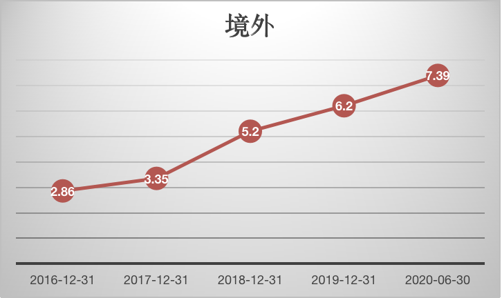

恒生电子是国内金融科技的龙头企业，主要设计到证券、期货、公募、信托、保险、私募、银行与产业、交易所以及新兴行业的软件开发。

### 竞争优势

#### 垄断地位

恒生电子作为金融 IT 领域的“绝对王者”，在国内金融软件系统市场份额处于绝对优势，是目前唯一拥有银行、保险、信托、期货、基金、清算所等金融领域全牌照的金融 IT 供应商，且各个领域的市占率均稳居第一。在全球金融科技排名中，公司连续 12 年获得 IDC Fintech Ranking Top 100。

且公司在最新一年排名上升到了第40位。

这一排名带来的好处也能从公司在海外的营收不断提升中能看到：

对研发的高度投入：

| 默认单位: 亿人民币         | 2019  | 2018  | 2017  | 2016  | 2015  | 2014  | 2013  |
|--------------------|-------|-------|-------|-------|-------|-------|-------|
| 营业收入               | 38.72 | 32.63 | 26.66 | 21.7  | 22.26 | 14.22 | 12.11 |
| 研发费用               | 15.6  | 14.05 | 12.79 | 10.5  | 8.62  | 5.9   | 5.01  |
| 研发费用率（%）              | 40.29 | 43.06 | 47.97 | 48.43 | 38.76 | 41.53 | 41.42 |
| 公司研发人员的数量          | 4,867 | 4,590 | 4,234 | 4,295 | 3,483 | 2579  | 2182  |
| 研发人员数量占公司总人数的比例（%） | 66.15 | 64.45 | 62.35 | 62.89 | 59.81 | 58.5  | 60.9  |

公司的研发人员逐年上升，如今已占公司员工总数的66.15%。

境外的营收占比逐年提高：

