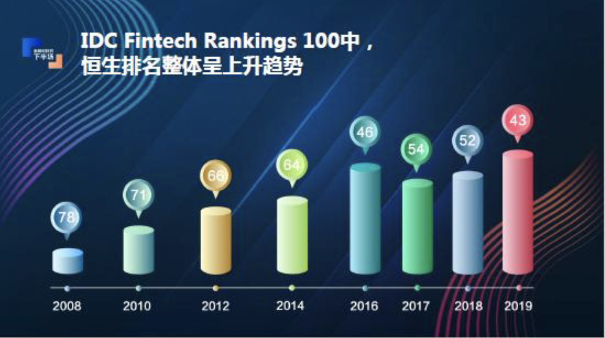
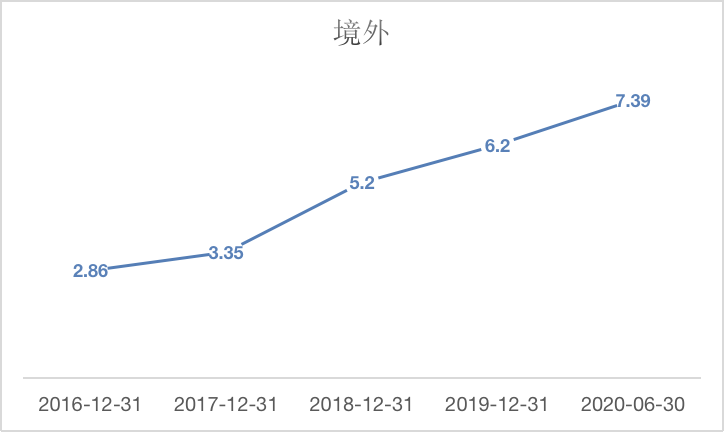
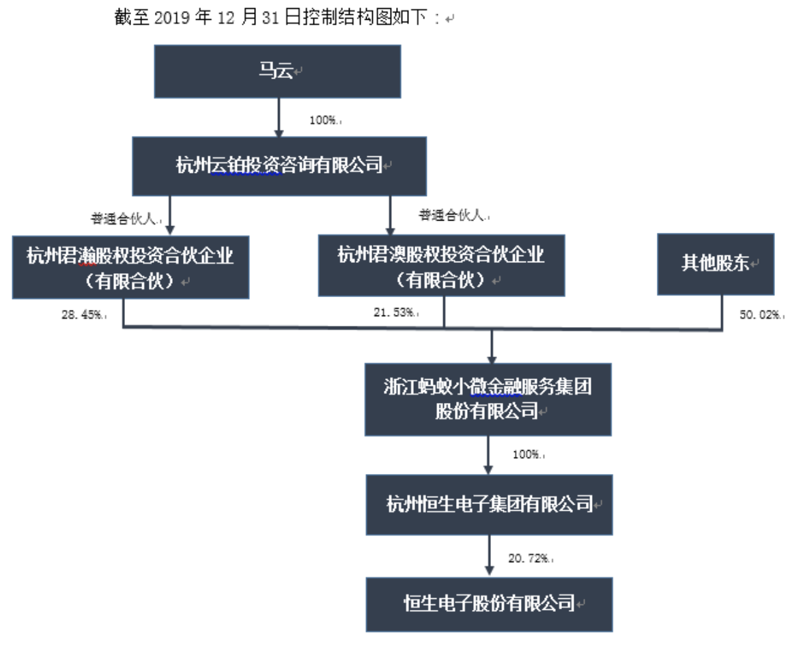

恒生电子是国内金融科技的龙头企业，主要设计到证券、期货、公募、信托、保险、私募、银行与产业、交易所以及新兴行业的软件开发。

##  资产状况

###  整体资产
  2019年总资产83.59亿，2018年62.16亿，共计新增21.43亿。其中2019年的负债为83.59-48.93=34.66亿，2018的负债为28.02亿，因此，新增的21.43亿资产里，有14.79亿是公司经过一年的经营活动挣来的（净利润14.15亿，其中有4.25亿用于分红），6.64亿是新增的借款。

###  负债的构成：
2019年公司共计负债34.66亿，其中应付账款1.8亿，预收账款14.18亿（软件销售及服务款）。有息负债仅为0.21亿的短期借款，和2.02亿的长期借款，这些负债占比很小。其他均为经营活动产生的负债。  

###  资产构成情况
2019年资产共计83.59亿，其中公司的货币资金13.29亿，金融资产26.94亿（其中23亿为银行短期理财产品、基金信托）。应收账款2.40亿，因为公司是属于金融科技这一行业，所以客户是蚂蚁金服、银行、券商这一类的主，坏账风险极低，且公司坏账计提标准严格。由于公司设计到软件开发这一行业自然不涉及到多少的预付款。还有4.9亿固定资产（3.76亿的房产），3.1亿的在建工程（恒生金融云产品生产基地）。1.1亿的无形资产，3.51亿的商誉。

公司扣非净利润8.9亿，净利润为14.15亿，差值5.25亿均为投资收益

## 行业地位

恒生电子作为金融 IT 领域的“绝对王者”，在国内金融软件系统市场份额处于绝对优势，是目前唯一拥有银行、保险、信托、期货、基金、清算所等金融领域全牌照的金融 IT 供应商，且各个领域的市占率均稳居第一。在全球金融科技排名中，公司连续 12 年获得 IDC Fintech Ranking Top 100。

**且公司在最新一年排名上升到了第40位。**

这一排名带来的好处也能从公司在海外的营收不断提升中能看到：

对研发的高度投入：

| 默认单位: 亿人民币         | 2019  | 2018  | 2017  | 2016  | 2015  | 2014  | 2013  |
|--------------------|-------|-------|-------|-------|-------|-------|-------|
| 营业收入               | 38.72 | 32.63 | 26.66 | 21.7  | 22.26 | 14.22 | 12.11 |
| 研发费用               | 15.6  | 14.05 | 12.79 | 10.5  | 8.62  | 5.9   | 5.01  |
| 研发费用率（%）              | 40.29 | 43.06 | 47.97 | 48.43 | 38.76 | 41.53 | 41.42 |
| 公司研发人员的数量          | 4,867 | 4,590 | 4,234 | 4,295 | 3,483 | 2579  | 2182  |
| 研发人员数量占公司总人数的比例（%） | 66.15 | 64.45 | 62.35 | 62.89 | 59.81 | 58.5  | 60.9  |

公司的研发人员逐年上升，如今已占公司员工总数的66.15%。

境外的营收占比逐年提高：

## 竞争优势

## 财务数据

| 时间       | 营业收入   | 增长率    | 净利润   | 增长率     | 经营净现  | 增长率     | 分红    | 分红率       | 市值     | 增长率     | 净资产   | 增长率    | 毛利率    | 净利率    | ROE    | PE     | PB    |
|----------|--------|--------|-------|---------|-------|---------|-------|-----------|--------|---------|-------|--------|--------|--------|--------|--------|-------|
| 2010(期初) | 8.67   | -      | 1.82  | -       | 1.73  | -       | 0.31  | 17.13%    | 126.31 | -       | 9.91  | -      | 75.30% | 25.56% | 24.34% | 62.31  | 14.36 |
| 2011     | 10.48  | 20.87% | 2.20  | 20.81%  | 1.96  | 13.10%  | 0.50  | 22.69%    | 76.35  | -39.56% | 12.18 | 22.93% | 79.61% | 25.00% | 23.04% | 37.31  | 7.29  |
| 2012     | 10.06  | -4.02% | -     | -       | 3.39  | 72.91%  | 0.62  | Infinity% | 69.92  | -8.42%  | 13.36 | 9.71%  | 79.06% | 21.10% | -      | 29.88  | 5.55  |
| 2013     | 12.11  | 20.32% | 2.73  | -       | 3.98  | 17.36%  | 0.99  | 36.24%    | 128.87 | 84.31%  | 16.50 | 23.48% | 81.84% | 28.09% | 21.73% | 55.45  | 8.90  |
| 2014     | 14.22  | 17.45% | 2.88  | 5.41%   | 6.14  | 54.18%  | 1.11  | 38.68%    | 338.31 | 162.51% | 19.16 | 16.12% | 93.68% | 24.97% | 20.32% | 132.06 | 20.27 |
| 2015     | 22.26  | 56.52% | 4.48  | 55.75%  | 9.92  | 61.63%  | 1.61  | 35.87%    | 376.68 | 11.34%  | 24.32 | 26.93% | 92.69% | 20.17% | 20.98% | 91.15  | 18.06 |
| 2016     | 21.70  | -2.49% | 1.78  | -60.26% | 4.40  | -55.64% | 0.62  | 34.71%    | 291.23 | -22.68% | 24.01 | -1.28% | 95.42% | -2.41% | 0.77%  | 71.21  | 11.87 |
| 2017     | 26.66  | 22.85% | 2.12  | 19.37%  | 8.05  | 82.96%  | 1.79  | 84.34%    | 286.66 | -1.57%  | 30.73 | 27.99% | 96.63% | 16.25% | 17.54% | 157.96 | 11.69 |
| 2018     | 32.63  | 22.38% | 5.16  | 142.77% | 9.37  | 16.43%  | 1.98  | 38.33%    | 321.14 | 12.03%  | 31.82 | 3.53%  | 97.11% | 20.79% | 19.83% | 116.89 | 11.35 |
| 2019     | 38.72  | 18.66% | 8.90  | 72.54%  | 10.71 | 14.27%  | 4.26  | 47.83%    | 624.29 | 94.40%  | 44.79 | 40.78% | 96.78% | 36.56% | 37.16% | 104.09 | 18.07 |
| 10年合计    | 188.83 |        | 30.24 |         | 57.91 |         | 13.47 |           |        |         |       |        |        |        |        |        |       |
| 10年平均    | 20.98  | 19.17% | 3.36  | 28.49%  | 6.43  | 30.80%  | 1.50  | Infinity% | 279.27 | 32.48%  | 24.10 | 18.91% | 90.31% | 21.17% | 17.93% | 88.44  | 12.56 |
| 复合增长     |        | 18.09% |       | 19.28%  |       | 22.42%  |       | 33.70%    |        | 19.43%  |       | 18.25% |

## 股权结构

https://www.reuters.com/article/jack-ma-buy-hengsheng-financial-service-idCNCNEA320A320140403

## 能否增长

## 缺点

